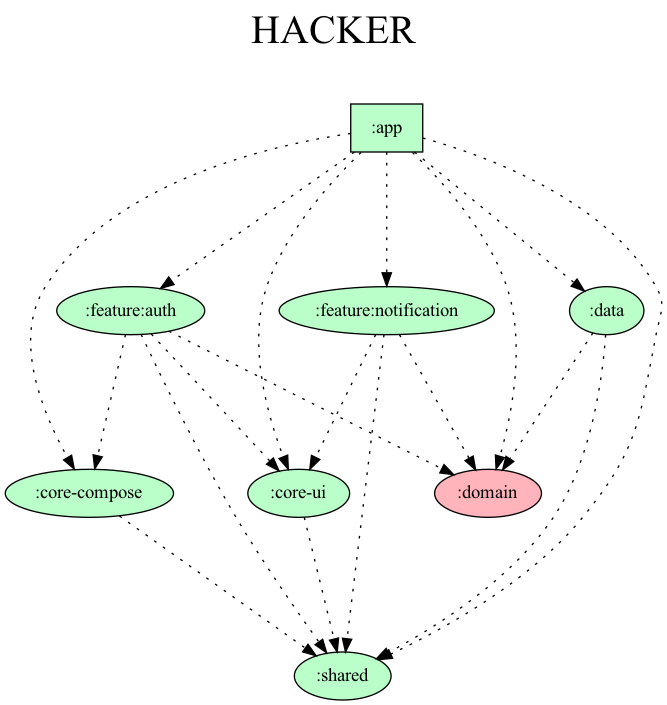

<h1 align="center">Hacker</h1>

    
    
    
    

	<h3 align="center">
		콩 심은 데 콩 나고, 커밋한 데 머리 난다! 개발자를 위한 커밋 기반 캐릭터 육성 서비스, Hacker
	</h3>	
	

<h2>Download</h2>

<h2>Tech Stack</h2>

- Minumum SDK 26
- Kotlin
    - Coroutines + Flow
    - Serialization
    - DateTime
- Dagger-Hilt
- AndroidX Jetpack
    - Lifecycle
    - Paging3
    - StartUp
    - SplashScreen
    - Security
    - Compose
- Retrofit2 & OkHttp3
- Coil
- Material Components
- Timber
- Flipper
- Lottie
- Firebase
    - Firebase Cloud Messaging
    - Firebase Analytics
- JUnit4

<h2>Architecture</h2>

Hacker는 Android 공식문서에 서술된 [Android App Architecture](https://developer.android.com/topic/architecture#recommended-app-arch)와 [Repository Pattern](https://proandroiddev.com/the-real-repository-pattern-in-android-efba8662b754)을 기반으로 작성하였습니다.

  

<h2>Module Dependency</h2>

  

## Contributors ✨

Thanks goes to these wonderful people ([emoji key](https://allcontributors.org/docs/en/emoji-key)):

<!-- ALL-CONTRIBUTORS-LIST:START - Do not remove or modify this section -->
<!-- prettier-ignore-start -->
<!-- markdownlint-disable -->
<table>
  <tr>
    <td align="center"><a href="http://velog.io/@l2hyunwoo"> <b>Hyun-Woo Lee</b></a> <a href="https://github.com/zaranaramorimori/HACKER-ANDROID/commits?author=l2hyunwoo" title="Code">💻</a></td>
    <td align="center"><a href="https://github.com/kkk5474096"> <b>Leekangmin</b></a> <a href="https://github.com/zaranaramorimori/HACKER-ANDROID/commits?author=kkk5474096" title="Code">💻</a></td>
    <td align="center"><a href="https://github.com/hansh0101"> <b>Seunghyeon Han</b></a> <a href="https://github.com/zaranaramorimori/HACKER-ANDROID/commits?author=hansh0101" title="Code">💻</a></td>
  </tr>
</table>

<!-- markdownlint-restore -->
<!-- prettier-ignore-end -->

<!-- ALL-CONTRIBUTORS-LIST:END -->

This project follows the [all-contributors](https://github.com/all-contributors/all-contributors) specification. Contributions of any kind welcome!
